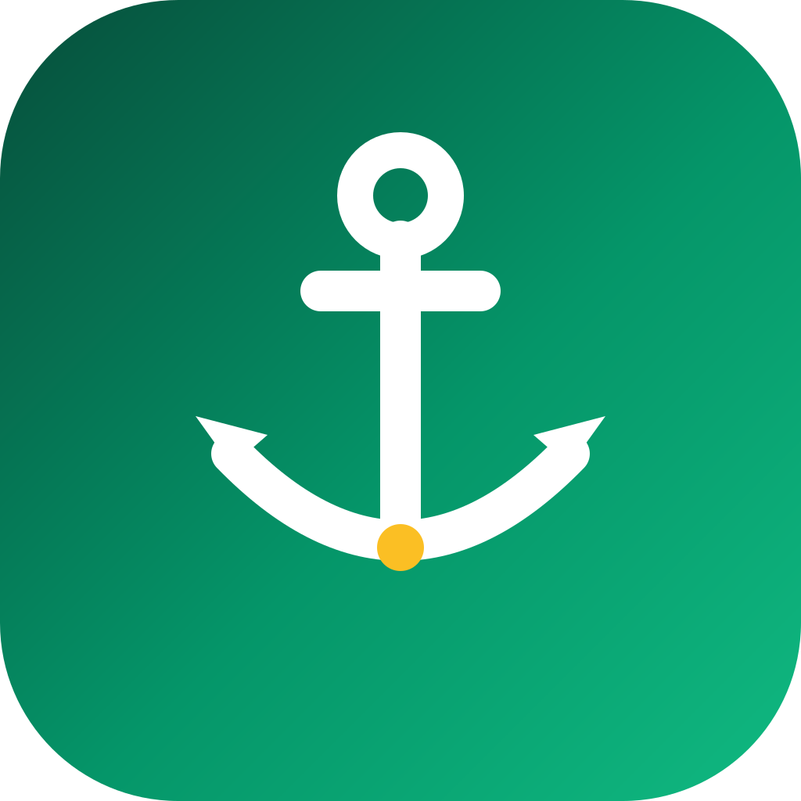

# Harbar



**a harbour for your fleet of agent sessions.**

you run a whole fleet of coding agents at once — **Claude Code** and **Codex** sessions scattered
across iTerm and Terminal tabs, VSCode and Cursor panes, JetBrains terminals, wherever they run.
Harbar is the harbour they all report into: one macOS menu bar panel showing every session at a
glance — which are working, which need your input, which are idle — so you stop alt-tabbing through
windows hunting for the one blocked on a prompt. click any session to sail straight to it.

```
🔐2 💤3 ▸1 ✓5      ← menu bar badge
─────────────────
🔐 PERMISSION (claude) (2)
   ◆ api@fix-login · refactor session    · iTerm     · 12s
   ◆ webapp@feat-search · add filters    · Cursor    · 1m
💤 IDLE PROMPT (waiting on you) (3)
   ◆ ...
🛑 APPROVAL (codex) (0)
▸ WORKING (1)
   ☁ worker@main · add retry logic       · VSCode    · 4s
✓ IDLE (5)
```

◆ = claude, ☁ = codex. each session shows `project@branch · task`.

## how it works

every Claude Code / Codex session fires hooks from your user-level config. a single dispatcher
(`harbar-hook.py`) writes a tiny JSON state file per session to `~/.harbar/sessions/`. a native menu
bar app (`Harbar.app`) reads those files, groups by status, and shows the panel. no server, no
polling of the agents — the hooks push state, the app reads it (every 2s, pruning dead sessions by
pid).

states: `working` (prompt submitted) · **needs input** split into 🔐 permission · 🛑 codex approval ·
📝 elicitation/form · 💤 idle-prompt · `idle` (turn done) · `error`. the label is `project@branch`
plus the first few words of the latest prompt; a working row also shows the **current tool**
(`editing focus.sh`, `$ git`, `searching`, …) so the panel stays useful even when nothing's blocked.

**reminders:** a session that's been blocked on input keeps getting a reminder banner on an
interval, so a stuck agent never goes silent if you miss the first ping. the interval is set
**per kind** from the menu (`off`, 1, 2, 5, 10, 15, 30 min) — defaults: permission / approval /
form = 5 min, idle prompt = 15 min.

## hooks it registers

every hook calls `harbar-hook.py <agent> --notify`, which writes a per-session state file and never
blocks the agent (silent stdout, always exits 0). Claude hooks are registered automatically by the
plugin (option A) or merged into `~/.claude/settings.json` by `install.sh` (option B). Codex hooks
live in `~/.codex/hooks.json` and must be trusted with `/hooks`.

**Claude Code:**

| hook | matcher | → |
|------|---------|---|
| `SessionStart` | — | idle (registers the session) |
| `UserPromptSubmit` | — | working (+ captures git branch + prompt label) |
| `PreToolUse` | — | working (+ shows the current tool: `editing X`, `$ git`, `searching`, …) |
| `Stop` | — | idle |
| `StopFailure` | — | error |
| `SessionEnd` | — | removes the tile |
| `Notification` | `permission_prompt\|idle_prompt\|elicitation_dialog` | needs input (🔐 / 💤 / 📝) |

**Codex** (subset — Codex has no `StopFailure` / `SessionEnd` / `Notification`):

| hook | → |
|------|---|
| `SessionStart` | idle |
| `UserPromptSubmit` | working |
| `PreToolUse` | working (+ current tool) |
| `Stop` | idle |
| `PermissionRequest` | needs input (🛑 approval) |

## requirements

- macOS (uses AppKit, `osascript`, `launchctl`)
- Xcode Command Line Tools (`swiftc`) — `xcode-select --install`
- `python3`
- Claude Code and/or Codex CLI with hooks enabled
- `terminal-notifier` (optional, for clickable notifications) — `brew install terminal-notifier`;
  the installer adds it automatically if Homebrew is present

## install

two ways — pick **one** (don't run both; you'd get duplicate Claude hooks).

### option A — Claude Code plugin (no clone)

inside Claude Code:

```
/plugin marketplace add olexandryermilov/harbar
/plugin install harbar@harbar
/harbar:install-app
```

`/plugin install` auto-registers the Claude hooks (no editing `settings.json`). `/harbar:install-app`
then builds `Harbar.app`, adds the login agent, installs `terminal-notifier`, and wires Codex.

### option B — manual (clone)

```sh
git clone https://github.com/olexandryermilov/harbar && cd harbar
./install.sh
```

copies scripts to `~/.harbar`, builds `~/Applications/Harbar.app`, merges the hooks into
`~/.claude/settings.json` and/or `~/.codex/hooks.json` (existing hooks preserved, with a timestamped
backup), and adds a launch-at-login agent. skip the login item: `HARBAR_AUTOSTART=0 ./install.sh`.

### either way, then:

1. **restart any running claude/codex sessions** so they pick up the new hooks.
2. **codex only — trust the hooks.** codex silently ignores untrusted user hooks, so codex sessions
   won't show up until you trust them: open codex, run **`/hooks`**, and trust the harbar entries
   (this writes `hooks.state.<key>.trusted_hash` to `~/.codex/config.toml`). re-run `/hooks` to
   re-trust if you ever change the hook commands. claude needs no trust step.

## updating

**plugin (option A):**
```
/plugin marketplace update harbar     # pull the latest from the marketplace repo
/plugin install harbar@harbar          # reinstall — picks up the new version's Claude hooks
/harbar:update                         # rebuild the native app + Codex hooks + login agent
```

**manual (option B):**
```sh
cd harbar && git pull && ./install.sh
```

the plugin auto-updates the **Claude hooks** on reinstall; the native **Harbar.app + Codex hooks +
login agent** are rebuilt by `/harbar:update` (or `/harbar:install-app`). then restart your
claude/codex sessions, and re-run codex `/hooks` trust only if the hook commands changed.

> maintainers: bump `version` in **both** `.claude-plugin/plugin.json` and the plugin entry in
> `.claude-plugin/marketplace.json` on each release — that's how clients detect a new version.

## usage

- **tracking works in any terminal or IDE** — iTerm, Terminal, VSCode, Cursor, JetBrains, WezTerm,
  Ghostty, … the hooks are Claude/Codex features and fire regardless of where the CLI runs.
- the badge shows counts per kind (zeros omitted). click it for the grouped list.
- click a session row to focus it:
  - **iTerm / Ghostty** — selects the **exact tab** via the terminal's AppleScript dictionary (iTerm
    matches by session id; Ghostty by a surface id the hook captures by writing a one-shot title
    marker to the session's own tty, so it's exact even when two sessions share a folder). first use
    asks to allow controlling that app (Automation).
  - **VSCode / Cursor / JetBrains / Terminal / …** — raises the app and, best-effort, the window
    whose title matches the project. macOS doesn't expose integrated-terminal tabs, so this lands on
    the project window, not the exact split. first use prompts for an Accessibility grant.
- a session entering needs-input pops a desktop notification (idle / permission / approval / form).
  with `terminal-notifier` installed, **clicking the notification focuses that terminal**; otherwise
  it's a plain banner. if the banners never show, grant **terminal-notifier** notification
  permission in System Settings → Notifications (it can get reset by Homebrew updates).
- still blocked? **reminders** re-ping on the per-kind interval set in the menu (`Reminders`
  submenu — one entry per kind). power users: `defaults write com.harbar.app "remind.permission_prompt" <n>` (0 = off).
- **snooze** a noisy session: open its row → `snooze (until it changes group)`. it goes quiet (no
  more reminders) while it stays in that kind, but if it shifts groups (e.g. idle-prompt →
  permission) you get notified again and the snooze clears. a snoozed row is marked 😴; `resume
  reminders` un-snoozes.
- ⌘R refresh, ⌘Q quit.

## caveats

- **codex hooks need a one-time trust step** (see install step 2) — until trusted, codex sessions
  won't appear. claude needs none.
- only **CLI** agents are tracked. the Claude *desktop app* and claude.ai in a browser have no hooks
  and can't be seen.
- on a notched Mac with a full menu bar, macOS may hide the icon behind the notch — free up menu bar
  space or use a manager like Ice.

## uninstall

- **plugin:** `bash ~/path/to/harbar/uninstall.sh` (app/agent/codex) + `/plugin uninstall harbar@harbar` (Claude hooks).
- **manual:** `./uninstall.sh`.

removes the app, the login agent, `~/.harbar`, and the harbar hooks from your configs (other hooks
kept). config backups (`*.harbar-bak-*`) are left in place.

## layout

```
.claude-plugin/marketplace.json   marketplace "harbar" (option A)
.claude-plugin/plugin.json        plugin manifest
hooks/hooks.json                  Claude hooks the plugin auto-registers (${CLAUDE_PLUGIN_ROOT}/src/harbar-hook.py)
skills/install-app/SKILL.md       /harbar:install-app — builds the app, agent, codex
src/harbar-hook.py                hook dispatcher (writes session state)
src/focus.sh                      click-to-focus terminal
src/merge-hooks.py                idempotent hook-config merge / removal
src/Harbar.swift                  the menu bar app (AppKit, single file)
src/Harbar-Info.plist             app bundle metadata
assets/icon.svg                   the anchor logo
install.sh / uninstall.sh         option B (manual) + shared by /harbar:install-app
tests/                            unit tests (stdlib unittest): hook state machine + merge logic
.github/workflows/ci.yml          CI: runs tests + lint on Linux, compiles the app on macOS
```

## development

```sh
python3 -m unittest discover -s tests -p 'test_*.py'   # run the test suite (no deps)
swiftc -O -framework AppKit src/Harbar.swift -o /tmp/Harbar   # compile-check the app
```

## license

MIT
